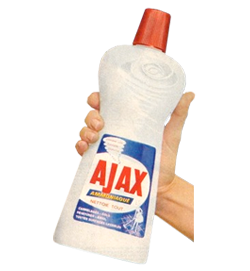

# A function to extends your chosen-select with AJAX

Jquery chosen is a very powerful plugin to change any `select` component into something cooler.

However it lack of AJAX capability. Let's say you have 10000000000000 `options` and you want to add it into your select component. This will hugely affect the size of your HTML, as well as reducing user's experience.

AJAX on the other hand provide a very sufficient mechanism to handle this. By using AJAX, you can simply `just load what you need`.

And here come the solution to keep everything clean yet usable:



Actually there was a plugin to do that [https://github.com/meltingice/ajax-chosen](https://github.com/meltingice/ajax-chosen).

However, for some reason it doesn't work anymore.

So, I decide to make my own. This might not the best quality plugin you ever see. I'm not so into javascript, and I need a hand from someone who is good with javascript.

# How to use

## TL;DR:

```html
<html>
    <head>
        <link rel="stylesheet" type="text/css" href="../chosen/chosen.min.css">
    </head>
    <body>
        <div>
            This is a normal select :
            <select id="normal_select">
                <option value="Indonesia">Indonesia</option>
                <option value="India">India</option>
                <option value="Japan">Japan</option>
                <option value="Philippines">Philippines</option>
            </select>
        </div>
        <div>
            This is a normal select, turn into chosen :
            <select id="chosen_select">
                <option value="Indonesia">Indonesia</option>
                <option value="India">India</option>
                <option value="Japan">Japan</option>
                <option value="Philippines">Philippines</option>
            </select>
        </div>
        <div>
            This is a normal select, turn into ajax-chosen :
            <select id="ajax_select">
                <option value="Indonesia">Indonesia</option>
                <option value="India">India</option>
                <option value="Japan">Japan</option>
                <option value="Philippines">Philippines</option>
            </select>
        </div>
        <script type="text/javascript" src="../jquery-1.11.3.min.js"></script>
        <script type="text/javascript" src="../chosen/chosen.jquery.min.js"></script>
        <!-- Beside chosen and jquer, you also need to include this: -->
        <script type="text/javascript" src="../gofrendi.chosen.ajaxify.js"></script>
        <script type="text/javascript">
            // This is how you usually use chosen
            $('#chosen_select').chosen({allow_single_deselect:true, width:"200px", search_contains: true});

            // This is also how you usually use chosen
            $('#ajax_select').chosen({allow_single_deselect:true, width:"200px", search_contains: true});
            // And this one is how you add AJAX capability
            chosen_ajaxify('ajax_select', 'server.php?keyword=');
        </script>
    </body>
</html>
```

## Parameter:

```javascript
chosen_ajaxify(ID, URL);
```

* ID is the id of your select
* URL is the url of your server script that provide AJAX response. The keyword will be appended to your url.

    For example, if your URL is `server.php?keyword=`, and your `keyword` is `indonesia`, then the response from `server.php?keyword=indonesia` will be used to populate your `chosen-select`.


## Expected Response From Server

The expected response is array of object(or associative array) in JSON format. The Objects should have two keys, `value` and `caption`. i.e:

```json
 [
     {"value":"Afghanistan","caption":"Afghanistan"},
     {"value":"Albania","caption":"Albania"},
     {"value":"Algeria","caption":"Algeria"},
     {"value":"Andorra","caption":"Andorra"},
     {"value":"Angola","caption":"Angola"}
 ]
 ```

## Todo

* Make this an extension of jquery chosen
